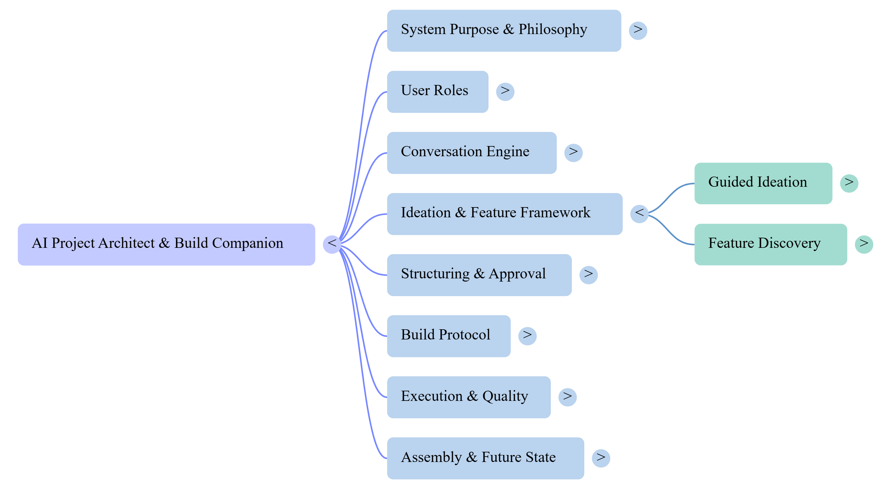

# AI Project Architect & Build Companion

> **The bridge from idea to execution.**

A chat-driven system that acts as a senior product thinker, technical architect, and execution guide — transforming raw business ideas into structured, build-ready project documentation that interns can execute without constant supervision.

**Build-ready in hours, not weeks.**

---

## The Problem: The Execution Gap

Every project starts as an idea. Most ideas die in the gap between vision and execution.

- **Idea Vagueness** — Raw ideas are incomplete and underspecified. Teams build against assumptions instead of decisions.
- **Mental Overload** — Founders carry the project vision in their heads. Every new team member restarts the explanation cycle.
- **Slow Project Spin-Up** — Interns lose days asking clarifying questions. Projects that should take weeks take months.
- **One-Off Thinking** — Manually creating project plans doesn't scale. Past thinking is lost the moment projects ship.


---

## The Solution

The AI Project Architect eliminates the execution gap through **precision, not automation theater**.

Unlike tools that generate walls of generic text and call them plans, this system:

- **Asks targeted questions** until intent is clear — never guesses silently
- **Requires explicit approval** at every gate — nothing advances without the user's say
- **Produces documents interns can execute** — the Intern Test is the final quality gate
- **Captures the process itself** so it can be automated and reused

The result: a single, structured Markdown document that answers every question an intern would ask — before they ask it.

---

## What This System Is NOT

- Does not generate vague "idea dumps" without structure
- Does not skip validation or approval gates to move faster
- Does not produce full applications or write code
- Does not replace human judgment or final decision-making
- Does not optimize for speed at the cost of clarity

**The goal is precision, not automation theater.**

---

## How It Works: The 5-Step Pipeline

```
Idea Intake ──→ Feature Discovery ──→ Outline Locking ──→ Chapter Build ──→ Final Assembly
```

| Step | What Happens | Key Artifact |
|------|-------------|--------------|
| **1. Idea Intake** | Raw idea captured verbatim; guided questioning explores business model, users, differentiation, and AI leverage | Refined idea in `project_state.json` |
| **2. Feature Discovery** | Catalog-based selection across product and architecture layers; core vs optional classification; anti-overengineering guardrails | Approved feature set with build order |
| **3. Outline Generation & Locking** | 7 required sections generated in strict order (Why → Who → What → How); approved outline locked with SHA256 integrity hash | Immutable outline contract |
| **4. Chapter-by-Chapter Build** | One chapter at a time — each with Purpose, Design Intent, and Implementation Guidance; max 2 revisions per chapter | Approved chapters |
| **5. Quality Gates & Assembly** | 5 mandatory validation checks; chapters compiled into a professional, version-controlled Markdown artifact | `{ProjectName}_Build_Guide_v{N}.md` |

For a detailed walkthrough of all 8 pipeline phases, see [docs/WORKFLOW.md](docs/WORKFLOW.md).

---

## The Five Quality Gates

Every document must pass all five checks before final assembly:

| Gate | What It Validates |
|------|-------------------|
| **Completeness** | All sections present, no placeholders ("TBD", "we'll decide later") |
| **Clarity** | Each chapter summarizable in one sentence, consistent terminology |
| **Build Readiness** | Clear execution order, defined inputs/outputs, component boundaries |
| **Anti-Vagueness** | Forbidden phrases (e.g., "handle edge cases", "optimize later") flagged and replaced with specifics |
| **Intern Success Test** | "Could an intern execute this project using only this document?" |

---

## System Architecture



The system follows an **Agent-First, Deterministic-Execution** model with four layers:

| Layer | Name | Location | Responsibility |
|-------|------|----------|---------------|
| 1 | **Directives** | `/directives` | Human-readable SOPs defining goals, inputs, outputs, edge cases, and verification |
| 2 | **Orchestration** | Claude / Chat Engine | Reads directives, drives conversation, reasons about next steps — never executes logic |
| 3 | **Execution** | `/execution` | Deterministic Python scripts — repeatable, testable, auditable, safe to rerun |
| 4 | **Verification** | `/tests` | Automated test suite — unit, directive structure, integration, and quality gate tests |

Four specialized agent personas guide the orchestration layer:

| Agent | Role |
|-------|------|
| **Project Architect** | Senior product thinker and execution guide across all phases |
| **Ideation Coach** | Structured thinking partner for idea refinement |
| **Quality Gatekeeper** | Systematic validation enforcer with checklist-driven evaluation |
| **Document Assembler** | Mechanical compilation specialist for final output |

For a deep technical reference, see [docs/ARCHITECTURE.md](docs/ARCHITECTURE.md).

---

## Feature Status

| Feature | Status | Business Value |
|---------|--------|---------------|
| Conversation Engine | **MVP** | Reduces cognitive load via Question → Response → Refinement loop |
| Guided Ideation Framework | **MVP** | Turns raw rants into specific, executable concepts |
| Feature Discovery | **In Progress** | Scope remains intentional with core/optional classification |
| Outline Generation | **MVP** | Prevents mid-build drift with locked scope contract |
| Final Document Assembly | **MVP** | Durable, version-controlled Markdown artifact |
| Quality Gates | **Planned** | Minimizes rework with 5-gate validation |
| Future Automation Hooks | **Planned** | Maps manual steps to AI agent capabilities |

---

## Real-World Use Cases

**New AI Agent Idea** — "I want to build a customer support bot" becomes a multi-chapter build guide with architecture, features, and execution steps — in hours.

**Internal Tool for Operations** — Turn a verbal process description into structured documentation that interns can pick up and build against without a single meeting.

**Training or Curriculum Project** — Convert subject matter expertise into a reusable training artifact with clear modules, sequencing, and execution guidance.

---

## Core Philosophies

1. **Conversation Before Construction** — Understand before building. No outline is generated until the idea is sharp.
2. **Approval Is a Gate, Not a Suggestion** — Nothing advances without explicit approval. "Looks good" is not approval.
3. **One Chapter, One Focus** — No bloated sections, no mixed responsibilities, no bulk generation.
4. **Assume VS Code / Claude Code** — Designed for the tools you already use. Supports real development, doesn't abstract it away.
5. **Build While Using** — Manual today, machine-enforceable tomorrow. Every rule is designed for future automation.

For the full design philosophy, see [docs/PHILOSOPHY.md](docs/PHILOSOPHY.md).

---

## The Intern Test

> *"If an intern must ask clarifying questions repeatedly, the system has failed."*

Every document produced by this system is validated against this standard. The final quality gate is binary: could a competent intern, with no additional context, successfully execute the project using only the generated document?

If the answer is no, the document is revised. Not the intern.

---

## Quick Start

```bash
# Clone the repository
git clone https://github.com/ColaberryIntern/AI_ProjectArchitect.git
cd AI_ProjectArchitect

# Create a virtual environment
python -m venv .venv
.venv\Scripts\activate        # Windows
# source .venv/bin/activate   # macOS/Linux

# Install dependencies
pip install -r requirements.txt

# Install dev dependencies
pip install pytest pytest-cov pytest-mock httpx

# Copy environment config and add your OpenAI API key
cp .env.example .env

# Start the web application
uvicorn app.main:app --reload

# Run the test suite
pytest

# Run with coverage
pytest --cov=execution --cov=app --cov-report=term-missing
```

---

## Project Structure

| Folder | Purpose | Key Files |
|--------|---------|-----------|
| `/agents` | Agent personas and behavioral rules | `project_architect.md`, `ideation_coach.md`, `quality_gatekeeper.md`, `document_assembler.md` |
| `/directives` | SOPs for each pipeline phase | `01-idea-intake.md` through `08-final-assembly.md`, `manual-workflow.md` |
| `/execution` | Deterministic Python scripts | `state_manager.py`, `feature_catalog.py`, `outline_generator.py`, `quality_gate_runner.py`, `document_assembler.py` |
| `/app` | FastAPI web application | `main.py`, `chat_engine.py`, `routers/`, `templates/`, `static/` |
| `/config` | Settings and JSON schemas | `settings.py`, `schemas/*.schema.json` |
| `/templates` | Markdown templates for output | `outline_template.md`, `chapter_template.md`, `final_document_template.md` |
| `/tests` | Automated test suite | Mirrors `/execution` and `/app` structure |
| `/docs` | Architecture, workflow, and philosophy docs | `ARCHITECTURE.md`, `WORKFLOW.md`, `PHILOSOPHY.md` |
| `/output` | Generated project documents | Gitignored — contains project state and build guides |

---

## Contributing

See [CONTRIBUTING.md](CONTRIBUTING.md) for development setup, architecture guidelines, and the Intern Standard.

---

## License

This project is proprietary to Colaberry / Novedea. All rights reserved.
